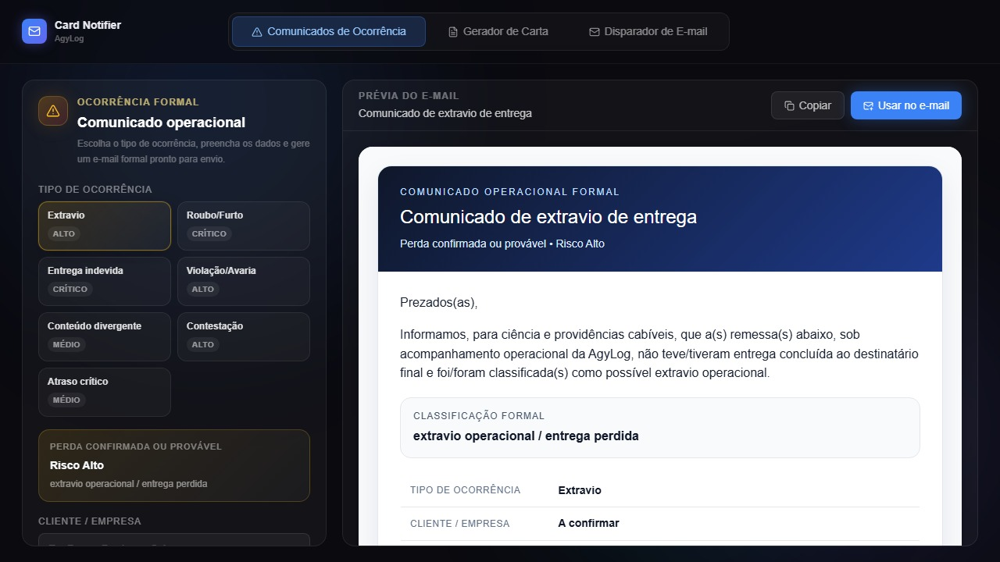

# Card Notifier — AgyLog

> Sistema de geração e disparo de comunicados operacionais formais, com prévia em tempo real do e-mail, gerador de cartas e disparador automático por SMTP.

🔒 **Acesso:** Sistema interno — produção restrita

<p>
  
  
  
  
</p>

---

## Problema

Comunicar ocorrências operacionais (extravios, roubos, avarias) exigia que a equipe redigisse e-mails formais manualmente a cada incidente, o que consumia tempo, gerava inconsistências e aumentava o risco de omissão de informações críticas.

## Solução

Sistema que automatiza a geração de comunicados formais: o operador seleciona o tipo de ocorrência, preenche os dados e o sistema gera um e-mail estruturado com linguagem jurídico-operacional padronizada, pronto para envio ou cópia imediata.

---

## Funcionalidades

- ✅ **7 tipos de ocorrência** classificados por severidade (Crítico / Alto / Médio):
  - Extravio · Roubo/Furto · Entrega Indevida · Violação/Avaria · Conteúdo Divergente · Contestação · Atraso Crítico
- ✅ **Prévia em tempo real** do e-mail gerado (renderização instantânea)
- ✅ **Gerador de Carta** formal em PDF
- ✅ **Disparador de E-mail** via SMTP integrado
- ✅ Linguagem padronizada com classificação formal de risco
- ✅ Botão "Copiar" e "Usar no e-mail" com um clique
- ✅ HTTPS via **nip.io** (certificado gratuito, sem domínio pago)

---

## Screenshots



---

## Arquitetura

```
[Operador seleciona ocorrência]
          ↓
[Frontend gera prévia em tempo real]
          ↓
    [Botão Disparar]
          ↓
[Backend Flask → SMTP → E-mail enviado]
          ↓
[Gerador de Carta → PDF server-side]
```

## Stack

| Camada | Tecnologia |
|---|---|
| Frontend | HTML · CSS · JavaScript (prévia em tempo real) |
| Backend | Python · Flask · Gunicorn |
| E-mail | SMTP (integração direta) |
| PDF | Geração server-side |
| HTTPS | nip.io (certificado gratuito) |
| Servidor | nginx · VPS Linux |
| Custo total | **R$ 0,00** |

---

> Parte do ecossistema AgyLog — 5 sistemas em produção, infraestrutura 100% open-source.
